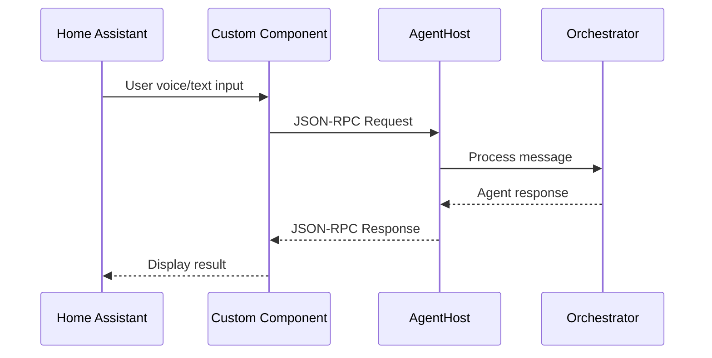

# JSON-RPC

Lucia uses **JSON-RPC 2.0** as the communication protocol between the Home Assistant custom component and the AgentHost. This provides a structured, bidirectional message format for sending user requests and receiving agent responses.

## Protocol Overview

The Home Assistant custom component (Python) sends JSON-RPC requests to the AgentHost (.NET) over HTTP. The AgentHost processes the request through its orchestration pipeline and returns a JSON-RPC response.



## Request Format

```json
{
  "jsonrpc": "2.0",
  "id": "req-001",
  "method": "message/send",
  "params": {
    "message": {
      "kind": "text",
      "role": "user",
      "parts": [
        {
          "type": "text",
          "text": "Turn on the living room lights"
        }
      ]
    },
    "messageId": "msg-abc123",
    "contextId": "ctx-session-001"
  }
}
```

### Request Fields

| Field | Type | Required | Description |
|---|---|---|---|
| `jsonrpc` | `string` | Yes | Must be `"2.0"` |
| `id` | `string` | Yes | Unique request identifier, used to match responses |
| `method` | `string` | Yes | RPC method to invoke |
| `params` | `object` | Yes | Method parameters |

### Supported Methods

| Method | Description |
|---|---|
| `message/send` | Send a user message to the orchestrator |
| `agent/list` | List all registered agents |
| `agent/status` | Get status of a specific agent |
| `system/health` | Health check |

## Response Format

### Success Response

```json
{
  "jsonrpc": "2.0",
  "id": "req-001",
  "result": {
    "message": {
      "kind": "text",
      "role": "assistant",
      "parts": [
        {
          "type": "text",
          "text": "I've turned on the living room lights for you."
        }
      ]
    },
    "messageId": "msg-def456",
    "agentName": "LightAgent",
    "traceId": "trace-789"
  }
}
```

### Response Fields

| Field | Type | Description |
|---|---|---|
| `jsonrpc` | `string` | Always `"2.0"` |
| `id` | `string` | Matches the request `id` |
| `result` | `object` | Present on success |
| `result.message` | `object` | Agent response message |
| `result.messageId` | `string` | Unique response message ID |
| `result.agentName` | `string` | Name of the agent that handled the request |
| `result.traceId` | `string` | Trace identifier for debugging |

### Error Response

```json
{
  "jsonrpc": "2.0",
  "id": "req-001",
  "error": {
    "code": -32603,
    "message": "Internal error: agent invocation failed",
    "data": {
      "agentName": "LightAgent",
      "detail": "Home Assistant API returned 503"
    }
  }
}
```

### Error Codes

| Code | Name | Description |
|---|---|---|
| `-32700` | Parse error | Invalid JSON |
| `-32600` | Invalid request | Missing required fields |
| `-32601` | Method not found | Unknown method name |
| `-32602` | Invalid params | Method parameters are invalid |
| `-32603` | Internal error | Server-side error during processing |
| `-32000` | Agent not found | Requested agent does not exist |
| `-32001` | Agent timeout | Agent did not respond within the configured timeout |
| `-32002` | HA unreachable | Cannot connect to Home Assistant |

## Message Structure

### Message Object

| Field | Type | Description |
|---|---|---|
| `kind` | `string` | Message kind: `text`, `tool_call`, `tool_result` |
| `role` | `string` | Sender role: `user`, `assistant`, `system` |
| `parts` | `array` | Array of content parts |

### Part Object

| Field | Type | Description |
|---|---|---|
| `type` | `string` | Part type: `text`, `tool_call`, `tool_result` |
| `text` | `string` | Text content (for `text` type) |
| `toolCallId` | `string` | Tool call identifier (for tool types) |
| `name` | `string` | Tool name (for `tool_call` type) |
| `arguments` | `object` | Tool arguments (for `tool_call` type) |
| `content` | `string` | Tool result content (for `tool_result` type) |

## Context and Conversation

The `contextId` field maintains conversation state across multiple exchanges. The AgentHost stores conversation history in Redis, keyed by `contextId`, enabling multi-turn interactions.

```json
// First turn
{
  "jsonrpc": "2.0",
  "id": "req-010",
  "method": "message/send",
  "params": {
    "message": {
      "kind": "text",
      "role": "user",
      "parts": [{"type": "text", "text": "What is the temperature in the bedroom?"}]
    },
    "messageId": "msg-010",
    "contextId": "ctx-conv-001"
  }
}

// Second turn (same contextId)
{
  "jsonrpc": "2.0",
  "id": "req-011",
  "method": "message/send",
  "params": {
    "message": {
      "kind": "text",
      "role": "user",
      "parts": [{"type": "text", "text": "Set it to 72 degrees"}]
    },
    "messageId": "msg-011",
    "contextId": "ctx-conv-001"
  }
}
```

:::info
The AgentHost uses `contextId` to retrieve conversation history from Redis, so the agent understands that "it" in the second message refers to the bedroom thermostat.
:::

## Example: Full Request/Response Cycle

```bash
curl -X POST http://localhost:5151/api/agents/invoke \
  -H "Content-Type: application/json" \
  -d '{
    "jsonrpc": "2.0",
    "id": "req-100",
    "method": "message/send",
    "params": {
      "message": {
        "kind": "text",
        "role": "user",
        "parts": [
          {
            "type": "text",
            "text": "Set the thermostat to 72 degrees"
          }
        ]
      },
      "messageId": "msg-100",
      "contextId": "ctx-session-050"
    }
  }'
```

Response:

```json
{
  "jsonrpc": "2.0",
  "id": "req-100",
  "result": {
    "message": {
      "kind": "text",
      "role": "assistant",
      "parts": [
        {
          "type": "text",
          "text": "I've set the thermostat to 72 degrees F."
        }
      ]
    },
    "messageId": "msg-101",
    "agentName": "ClimateAgent",
    "traceId": "trace-abc123"
  }
}
```
