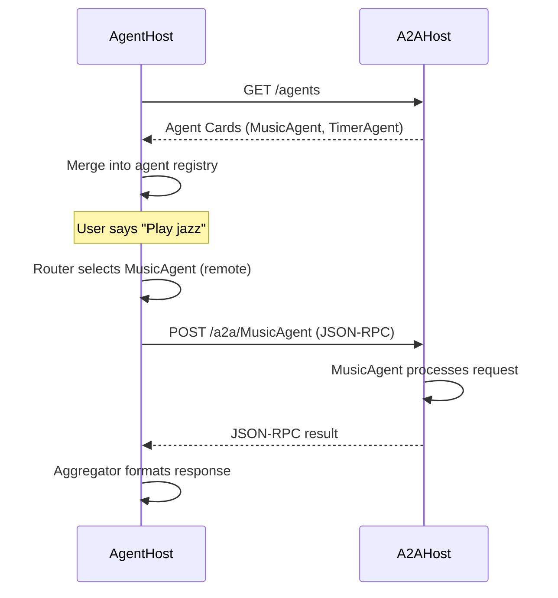

# A2A Protocol

Lucia uses the **Agent-to-Agent (A2A) Protocol** for communication between hosts and agents. The protocol is built on **JSON-RPC 2.0** over HTTP, providing a simple, standards-based interface for agent discovery and message exchange.

## Core Concepts

### AgentHost vs A2AHost

| | AgentHost | A2AHost |
|---|---|---|
| **Role** | Primary API server. Runs the orchestrator and in-process agents. | Satellite host. Runs one or more agents as a separate process. |
| **Exposes** | REST API, JSON-RPC endpoint, Dashboard API, A2A discovery. | A2A discovery and messaging endpoints only. |
| **Discovers** | Registers local agents and queries remote A2AHosts for their agent cards. | Registers its own agents and responds to discovery queries. |
| **Deployment** | Exactly one instance (see [Deployment Modes](./deployment-modes.md)). | Zero or more instances, one per satellite service. |

The AgentHost acts as the **client** in A2A interactions. During startup it queries each configured A2AHost for available agents and merges them into the unified agent registry.

## Agent Discovery

### Endpoint

```
GET /agents
```

Returns an array of **Agent Cards** describing the agents hosted by that process.

### Example Response

```json
{
  "agents": [
    {
      "name": "MusicAgent",
      "description": "Plays, pauses, skips, and queues music on media players.",
      "domains": ["music", "media", "playback"],
      "version": "1.2.0",
      "capabilities": {
        "tools": ["play_music", "pause_music", "skip_track", "queue_track", "search_music"],
        "streaming": false
      }
    },
    {
      "name": "TimerAgent",
      "description": "Sets countdown timers, named timers, and one-shot reminders.",
      "domains": ["timer", "reminder", "alarm"],
      "version": "1.0.0",
      "capabilities": {
        "tools": ["set_timer", "cancel_timer", "list_timers", "set_reminder"],
        "streaming": false
      }
    }
  ]
}
```

## Sending Messages

### Endpoint

```
POST /a2a/{agent-name}
```

Sends a JSON-RPC 2.0 request to a specific agent by name.

### Request Format

```json
{
  "jsonrpc": "2.0",
  "id": "req-abc-123",
  "method": "message/send",
  "params": {
    "message": {
      "role": "user",
      "parts": [
        {
          "type": "text",
          "text": "Play some jazz in the living room"
        }
      ]
    },
    "context": {
      "conversationId": "conv-456",
      "userId": "user-1",
      "entities": {
        "area": "living_room"
      }
    }
  }
}
```

### Response Format

```json
{
  "jsonrpc": "2.0",
  "id": "req-abc-123",
  "result": {
    "message": {
      "role": "agent",
      "parts": [
        {
          "type": "text",
          "text": "Now playing jazz in the Living Room."
        }
      ]
    },
    "metadata": {
      "agent": "MusicAgent",
      "confidence": 0.96,
      "latencyMs": 820,
      "tokensUsed": 134
    }
  }
}
```

### Error Response

```json
{
  "jsonrpc": "2.0",
  "id": "req-abc-123",
  "error": {
    "code": -32603,
    "message": "Media player entity not found for area 'living_room'.",
    "data": {
      "agent": "MusicAgent",
      "errorType": "EntityResolutionError"
    }
  }
}
```

## Registration Flow



## Configuration

Remote A2AHost endpoints are configured in the AgentHost's settings:

```json
{
  "A2A": {
    "RemoteHosts": [
      {
        "Name": "media-host",
        "BaseUrl": "http://lucia-a2a-media:5100",
        "HealthCheckIntervalSeconds": 30
      }
    ]
  }
}
```

:::warning
Agent names must be globally unique across all hosts. If two hosts register an agent with the same name, the AgentHost will log a warning and prefer the local (in-process) agent.
:::
