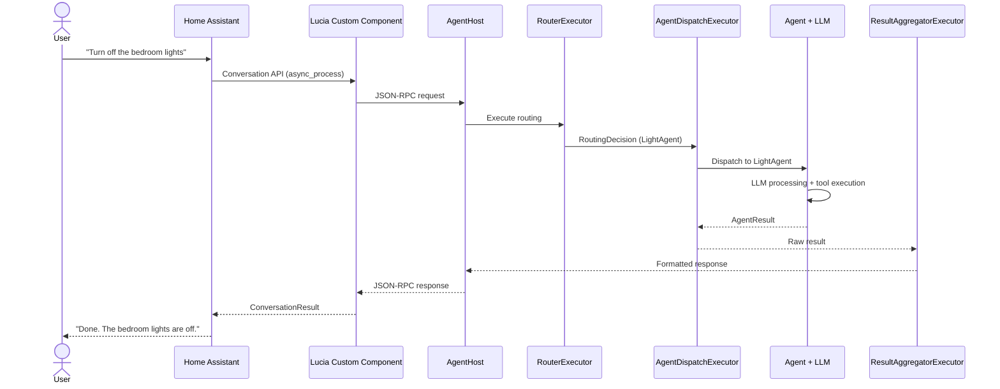

# Data Flow

This page walks through the complete lifecycle of a single request, from the moment a user speaks to the moment Home Assistant plays back the response.

## Request Lifecycle



## Step-by-Step Breakdown

### Step 1: User Input

The user speaks or types a command. Home Assistant captures the input through its voice pipeline (Assist) or a companion app.

### Step 2: Home Assistant Conversation API

Home Assistant invokes the **Conversation API** on the Lucia custom component. The component receives the raw text and the conversation ID.

### Step 3: JSON-RPC Request

The Lucia custom component serializes the input into a **JSON-RPC 2.0** `message/send` request and sends it to the AgentHost over HTTP.

```json
{
  "jsonrpc": "2.0",
  "id": "ha-req-001",
  "method": "message/send",
  "params": {
    "message": {
      "role": "user",
      "parts": [{ "type": "text", "text": "Turn off the bedroom lights" }]
    },
    "context": {
      "conversationId": "conv-789",
      "userId": "ha-user-1"
    }
  }
}
```

### Step 4: Orchestrator Receives Request

The AgentHost deserializes the JSON-RPC request, creates an `OrchestratorContext`, and enters the pipeline.

### Step 5: RouterExecutor

The router analyzes the user's message to select the best agent:

1. Runs semantic matching against agent domain descriptors.
2. Extracts entities using the **HybridEntityMatcher** (resolves "bedroom lights" to `light.bedroom_ceiling`, `light.bedroom_lamp`).
3. Produces a `RoutingDecision`: agent = `LightAgent`, confidence = 0.97.

### Step 6: AgentDispatchExecutor

The dispatcher looks up `LightAgent` in the agent registry, determines it is **in-process**, and calls its `ProcessAsync` method directly with the routing context and matched entities.

### Step 7: LLM Processing and Tool Execution

The LightAgent constructs a prompt containing:

- Its system prompt (domain rules, output format).
- The matched entity IDs and their current states.
- The user's message.

The LLM responds with a tool call:

```json
{
  "tool": "turn_off_light",
  "arguments": {
    "entity_ids": ["light.bedroom_ceiling", "light.bedroom_lamp"]
  }
}
```

The agent executes the tool, which calls the Home Assistant WebSocket API through the **HomeAssistant Client** to turn off both lights. The tool result is fed back to the LLM, which generates the final natural-language response.

### Step 8: ResultAggregatorExecutor

The aggregator receives the raw `AgentResult` and:

- Extracts the response text: "Done. The bedroom lights are off."
- Attaches metadata (agent name, confidence, latency, tokens used).
- Wraps everything in the standard response envelope.

### Step 9: JSON-RPC Response

The AgentHost serializes the aggregated result into a JSON-RPC response and sends it back to the custom component.

```json
{
  "jsonrpc": "2.0",
  "id": "ha-req-001",
  "result": {
    "message": {
      "role": "agent",
      "parts": [{ "type": "text", "text": "Done. The bedroom lights are off." }]
    },
    "metadata": {
      "agent": "LightAgent",
      "confidence": 0.97,
      "latencyMs": 645,
      "tokensUsed": 98
    }
  }
}
```

### Step 10: Home Assistant Speech Output

The custom component converts the JSON-RPC response into a `ConversationResult`. Home Assistant passes the response text to the TTS engine (if using voice) or displays it in the companion app.

## Data Persistence

At several points during the lifecycle, data is persisted for history and debugging:

| Store | Data | Purpose |
|---|---|---|
| **MongoDB** | Conversation history, entity aliases, lists, user preferences | Long-term persistence |
| **Redis** | Prompt cache, entity embeddings, session state | Low-latency caching |

:::note
The full request lifecycle typically completes in **500-1500 ms** depending on the LLM provider and whether prompt caching is warm. Local models via Ollama tend toward the lower end; cloud providers vary with network latency.
:::
