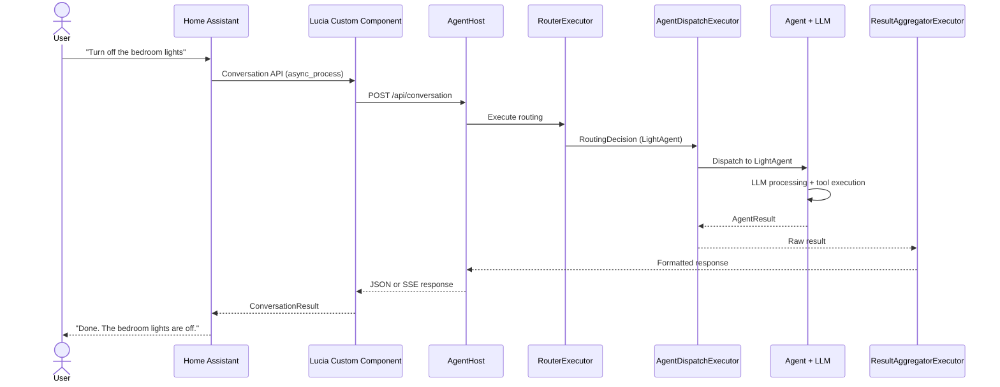
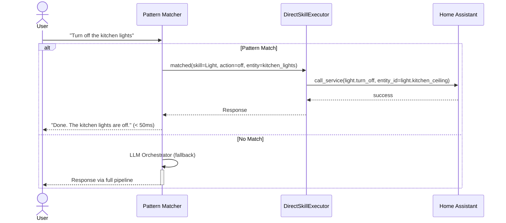

# Data Flow

This page walks through the complete lifecycle of a single request, from the moment a user speaks to the moment Home Assistant plays back the response.

## Request Lifecycle


```mermaid
sequenceDiagram
    actor U as User
    participant HA as Home Assistant
    participant CC as Lucia Custom Component
    participant AH as AgentHost
    participant R as RouterExecutor
    participant D as AgentDispatchExecutor
    participant Ag as Agent + LLM
    participant Agg as ResultAggregatorExecutor

    U->>HA: "Turn off the bedroom lights"
    HA->>CC: Conversation API (async_process)
    CC->>AH: POST /api/conversation
    AH->>R: Execute routing
    R->>D: RoutingDecision (LightAgent)
    D->>Ag: Dispatch to LightAgent
    Ag->>Ag: LLM processing + tool execution
    Ag-->>D: AgentResult
    D-->>Agg: Raw result
    Agg-->>AH: Formatted response
    AH-->>CC: JSON or SSE response
    CC-->>HA: ConversationResult
    HA-->>U: "Done. The bedroom lights are off."
```

## Step-by-Step Breakdown

### Step 1: User Input

The user speaks or types a command. Home Assistant captures the input through its voice pipeline (Assist) or a companion app.

### Step 2: Home Assistant Conversation API

Home Assistant invokes the **Conversation API** on the Lucia custom component. The component receives the raw text and the conversation ID.

### Step 3: REST Conversation Request

The Lucia custom component sends the text and structured Home Assistant context to `POST /api/conversation`.

```json
{
  "text": "Turn off the bedroom lights",
  "conversationId": "conv-789",
  "context": {
    "userId": "ha-user-1",
    "area": "bedroom",
    "timestamp": "2026-08-30T12:00:00Z"
  }
}
```

### Step 4: Orchestrator Receives Request

The AgentHost validates the conversation request, creates an `OrchestratorContext`, and enters the pipeline.

### Step 5: RouterExecutor

The router analyzes the user's message to select the best agent:

1. Runs semantic matching against agent domain descriptors.
2. Extracts entities using the **HybridEntityMatcher** (resolves "bedroom lights" to `light.bedroom_ceiling`, `light.bedroom_lamp`).
3. Produces a `RoutingDecision`: agent = `LightAgent`, confidence = 0.97.

### Step 6: AgentDispatchExecutor

The dispatcher looks up `LightAgent` in the agent registry, sees an **in-process** agent, and calls its `ProcessAsync` method directly with the routing context and matched entities.

### Step 7: LLM Processing and Tool Execution

The LightAgent constructs a prompt containing:

- Its system prompt (domain rules, output format).
- The matched entity IDs and their current states.
- The user's message.

The LLM responds with a tool call:

```json
{
  "tool": "turn_off_light",
  "arguments": {
    "entity_ids": ["light.bedroom_ceiling", "light.bedroom_lamp"]
  }
}
```

The agent executes the tool, which calls the Home Assistant WebSocket API through the **HomeAssistant Client** to turn off both lights. The tool result is fed back to the LLM, which generates the final natural-language response.

### Step 8: ResultAggregatorExecutor

The aggregator receives the raw `AgentResult` and:

- Extracts the response text: "Done. The bedroom lights are off."
- Attaches metadata (agent name, confidence, latency, tokens used).
- Wraps everything in the standard response envelope.

### Step 9: Conversation Response

The AgentHost sends an immediate JSON response for a direct command or Server-Sent Events for an LLM-backed request.

```json
{
  "response": {
    "speech": {
      "plain": {
        "speech": "Done. The bedroom lights are off."
      }
    },
    "response_type": "action_done"
  },
  "conversationId": "conv-789"
}
```

### Step 10: Home Assistant Speech Output

The custom component converts the response into a `ConversationResult`. Home Assistant passes the text to the TTS engine (if using voice) or displays it in the companion app.

## Data Persistence

At several points during the lifecycle, data is persisted for history and debugging:

| Store | Data | Purpose |
|---|---|---|
| **SQLite, PostgreSQL, or MongoDB** | Conversation history, entity aliases, lists, memory, user preferences | Long-term persistence |
| **Redis** | Prompt cache, entity embeddings, session state | Low-latency caching |

:::note
The full request lifecycle typically completes in **500-1500 ms** depending on the LLM provider and whether prompt caching is warm. Local models via Ollama tend toward the lower end; cloud providers vary with network latency.
:::

## Command Parser Fast-Path (v1.2.0)

In v1.2.0, Lucia introduced a fast-path for common smart home commands using the **Conversation Command Parser**. This bypasses the LLM entirely for recognized patterns:


```mermaid
sequenceDiagram
    actor U as User
    participant Parser as Pattern Matcher
    participant Exec as DirectSkillExecutor
    participant HA as Home Assistant

    U->>Parser: "Turn off the kitchen lights"
    alt Pattern Match
        Parser->>Exec: matched(skill=Light, action=off, entity=kitchen_lights)
        Exec->>HA: call_service(light.turn_off, entity_id=light.kitchen_ceiling)
        HA-->>Exec: success
        Exec-->>Parser: Response
        Parser-->>U: "Done. The kitchen lights are off." (< 50ms)
    else No Match
        Parser->>+Parser: LLM Orchestrator (fallback)
        Parser-->>-U: Response via full pipeline
    end
```

**Benefits:**
- Sub-50ms response time for recognized commands (no network LLM call)
- Reduced API costs (LLM invoked only for novel/complex requests)
- Consistent response templates for common operations

**Supported Patterns:**
- Light control: on/off, brightness, color ("turn on the living room lights", "dim the kitchen to 50%")
- Climate control: temperature, HVAC mode ("set the temperature to 72", "switch to cooling")
- Scene activation: ("activate the movie scene", "turn on bedtime")

See [Conversation Command Parser](/docs/api/conversation-api) for full API reference and pattern syntax.

## Wyoming Voice Data Flow (v1.2.0)

The Wyoming Voice Platform processes audio through a complete speech pipeline:

```
Audio Input
    |
    v
VAD (Voice Activity Detection)
    |
    v
Speech Enhancement (GTCRN)
    |
    v
Multi-Engine STT (Hybrid/Sherpa/Granite ONNX)
    |
    v
Speaker Verification
    |
    v
Text Output → Command Parser or LLM Orchestrator
```

**Key Stages:**
1. **VAD**: detects speech/silence boundaries with configurable thresholds
2. **Speech Enhancement**: GTCRN reduces background noise for cleaner transcription
3. **STT**: streams audio through HybridSttEngine for low-latency + high-accuracy transcription
4. **Speaker Verification**: cosine-similarity matching against enrolled speaker profiles
5. **Text Dispatch**: recognized speaker's text goes to the command parser first; fallback to LLM for complex requests

The Wyoming server advertises via mDNS/Zeroconf for automatic Home Assistant satellite discovery. See [Voice Platform](/docs/architecture/voice-platform) for model management and configuration details.
