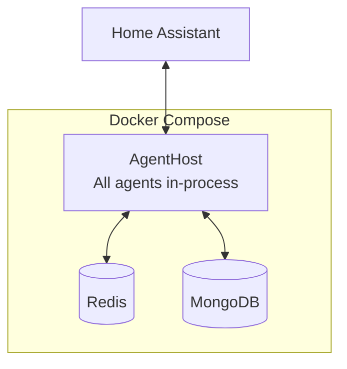
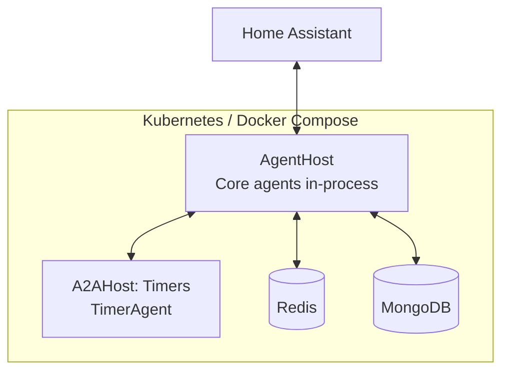

# Deployment Modes

Lucia supports two deployment modes: **Standalone** and **Mesh**. The mode determines whether agents run in a single process or are distributed across multiple containers.

## Standalone Mode (Default)

In standalone mode, all agents run **in-process** inside the AgentHost. This is the simplest deployment and the recommended starting point.



### Characteristics

- Single container for the AgentHost (plus Redis and MongoDB).
- All agent dispatch is in-process (no network overhead).
- No A2AHost instances needed.
- Suitable for single-server and Raspberry Pi deployments.

### Minimal Docker Compose

```yaml
services:
  lucia:
    image: lucia/agent-host:latest
    ports:
      - "5000:5000"
    environment:
      - Deployment__Mode=standalone
    depends_on:
      - redis
      - mongo

  redis:
    image: redis:7-alpine
    ports:
      - "6379:6379"

  mongo:
    image: mongo:7
    ports:
      - "27017:27017"
    volumes:
      - mongo-data:/data/db

volumes:
  mongo-data:
```

## Mesh Mode

In mesh mode, one or more agents run in **separate A2AHost containers**. The AgentHost discovers remote agents at startup and dispatches requests over the A2A protocol.



### Characteristics

- Agents can scale and deploy independently.
- Each A2AHost is a lightweight container running one or more agents.
- Suitable for Kubernetes clusters and multi-machine setups.
- Allows assigning different hardware (e.g., a GPU node) to specific agents.

### Enabling Mesh Mode

Set the environment variable on the AgentHost:

```bash
Deployment__Mode=mesh
```

Then configure the remote host endpoints:

```json
{
  "A2A": {
    "RemoteHosts": [
      {
        "Name": "timer-host",
        "BaseUrl": "http://lucia-a2a-timers:5101"
      }
    ]
  }
}
```

### Docker Compose (Mesh)

```yaml
services:
  lucia:
    image: lucia/agent-host:latest
    ports:
      - "5000:5000"
    environment:
      - Deployment__Mode=mesh
      - A2A__RemoteHosts__0__Name=timer-host
      - A2A__RemoteHosts__0__BaseUrl=http://lucia-a2a-timers:5101
    depends_on:
      - redis
      - mongo
      - lucia-a2a-timers

  lucia-a2a-timers:
    image: lucia/a2a-host:latest
    ports:
      - "5101:5101"
    environment:
      - Agents__Enabled=TimerAgent

  redis:
    image: redis:7-alpine

  mongo:
    image: mongo:7
    volumes:
      - mongo-data:/data/db

volumes:
  mongo-data:
```

## Single-Instance Constraint

:::danger Important
The **AgentHost must run as a single replica**. Do not scale it horizontally behind a load balancer.
:::

This constraint exists because two internal stores are held in memory:

| Store | Purpose |
|---|---|
| **ScheduledTaskStore** | Tracks scheduled automations and deferred actions. State is not replicated. |
| **ActiveTimerStore** | Tracks running countdown timers and reminders. Timers fire from the process that created them. |

Running multiple AgentHost replicas would cause:

- Duplicate timer firings or missed timers.
- Inconsistent scheduled task state.
- Split-brain routing decisions.

If you need high availability, use mesh mode and place the stateful components (TimerAgent) in a dedicated A2AHost that itself runs as a single replica. The AgentHost can then be restarted quickly without losing timer state on the satellite.

## Comparison

| | Standalone | Mesh |
|---|---|---|
| **Containers** | 1 (+ Redis, MongoDB) | 1 AgentHost + N A2AHosts (+ Redis, MongoDB) |
| **Agent dispatch** | In-process | In-process + A2A over HTTP |
| **Latency** | Lowest | Slight overhead for remote agents |
| **Complexity** | Minimal | Requires service discovery configuration |
| **Scaling** | Vertical only | Horizontal for individual agents |
| **Best for** | Single server, Pi, home lab | Kubernetes, multi-node, GPU offloading |
| **Environment variable** | `Deployment__Mode=standalone` | `Deployment__Mode=mesh` |
