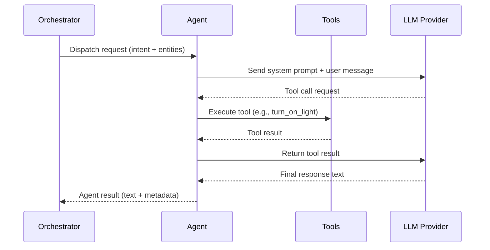

# Multi-Agent System

Lucia delegates work to a set of **specialized agents**, each responsible for a single domain. This separation keeps prompts focused, reduces token usage, and allows agents to evolve independently.

## How Agents Work

Every agent has three defining characteristics:

1. **Domain scope** -- a narrow set of intents it can handle (e.g., lights, climate, music).
2. **Tools** -- domain-specific functions the agent can invoke (e.g., `turn_on_light`, `set_thermostat`).
3. **LLM prompt** -- a system prompt tailored to the domain, including entity context, constraints, and output format instructions.

When a request arrives, the orchestrator's router determines which agent is the best match and dispatches the request to that agent. The agent then uses its tools and LLM prompt to process the request and return a result.

## Agent Types

### In-Process Agents

These agents run inside the AgentHost process. They are the default and require no additional infrastructure.

| Agent | Domain | Responsibilities |
|---|---|---|
| **LightAgent** | Lighting | Turn lights on/off, set brightness, color, color temperature. Handles room-level and individual light commands. |
| **ClimateAgent** | HVAC / Climate | Set thermostat target temperature, change HVAC mode, read current temperature and humidity. |
| **SceneAgent** | Scenes & Automations | Activate Home Assistant scenes, trigger automations, manage scene presets. |
| **ListsAgent** | Lists & Notes | Create and manage shopping lists, to-do lists, and freeform notes. Persisted to MongoDB. |
| **GeneralAgent** | Fallback / Conversation | Handles general knowledge questions, casual conversation, and any request that does not match a specialized agent. |

### A2A Agents (Satellite)

These agents run in a separate **A2AHost** process. They communicate with the AgentHost over the A2A protocol and can be deployed as independent containers.

| Agent | Domain | Responsibilities |
|---|---|---|
| **MusicAgent** | Media Playback | Play, pause, skip, and queue music on media players. Supports search by artist, album, track, or playlist. |
| **TimerAgent** | Timers & Reminders | Set countdown timers, named timers, and one-shot reminders. Maintains an in-memory ActiveTimerStore. |

:::info
Any agent can be moved between in-process and A2A hosting. The distinction above reflects the default configuration. See [Deployment Modes](./deployment-modes.md) for details on running agents as separate services.
:::

## Agent Lifecycle



## Adding a Custom Agent

Custom agents can be added through the plugin system. A minimal agent implementation requires:

1. A class implementing the `IAgent` interface.
2. A unique agent name and domain descriptor.
3. Registration in the dependency injection container or via plugin manifest.

```csharp
public class WeatherAgent : IAgent
{
    public string Name => "WeatherAgent";
    public string Description => "Provides weather forecasts and current conditions.";
    public string[] Domains => ["weather", "forecast", "temperature_outdoor"];

    public async Task<AgentResult> ProcessAsync(AgentRequest request, CancellationToken ct)
    {
        // Agent logic here
    }
}
```

The orchestrator's router will automatically discover registered agents and include them in routing decisions.
