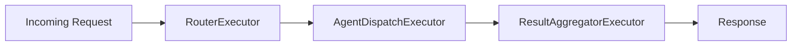
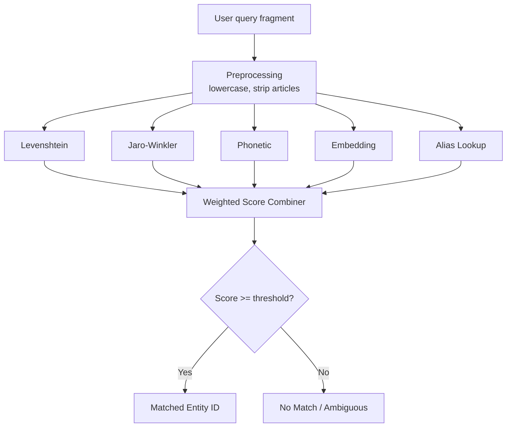

# Orchestration Pipeline

The orchestrator is the central coordination layer in Lucia. It receives every inbound request and passes it through a **three-stage pipeline** before returning a response.

## Stage 1: RouterExecutor

The router determines **which agent** should handle the request.

### Routing Strategy

1. **Semantic matching.** The router compares the user's intent against each agent's domain descriptors using a lightweight embedding similarity check. This avoids a full LLM call for clear-cut requests.
2. **LLM-assisted routing.** When semantic matching is ambiguous (multiple agents score above the confidence threshold), the router sends a classification prompt to the LLM. The prompt includes agent names, descriptions, and the user's message. The LLM returns a ranked list of candidate agents.
3. **Prompt caching.** The router's system prompt and agent catalog are cached at the LLM provider level. Subsequent routing calls reuse the cached prefix, reducing latency and token cost.

The router outputs a `RoutingDecision` containing the selected agent name, confidence score, and any extracted entities.

## Stage 2: AgentDispatchExecutor

The dispatcher sends the request to the selected agent. It handles two transport modes transparently:

| Mode | Description |
|---|---|
| **In-process** | The agent runs inside the AgentHost. The dispatcher calls the agent's `ProcessAsync` method directly. No network overhead. |
| **A2A (remote)** | The agent runs in a separate A2AHost. The dispatcher sends a JSON-RPC `message/send` request over HTTP to the remote host. |

The dispatcher resolves the transport mode from the agent registry. If a remote agent is unreachable after retry, the dispatcher falls back to the GeneralAgent.

## Stage 3: ResultAggregatorExecutor

The aggregator takes the raw agent result and formats it for the caller:

- Extracts the natural-language response text.
- Attaches metadata (agent name, confidence, latency, token usage).
- Normalizes error states into a consistent error envelope.
- Converts structured tool outputs (e.g., a list of entities that changed) into a human-readable summary when needed.

## HybridEntityMatcher

Entity matching is a cross-cutting concern used by the router and individual agents to resolve natural-language references (e.g., "the kitchen lights") to Home Assistant entity IDs.

The **HybridEntityMatcher** combines multiple strategies with weighted scoring:

| Strategy | Weight | Description |
|---|---|---|
| **Levenshtein distance** | 0.20 | Edit distance normalized to a 0-1 similarity score. Catches typos and minor variations. |
| **Jaro-Winkler similarity** | 0.20 | Gives extra weight to matching prefixes. Effective for names that share a common start. |
| **Phonetic encoding** | 0.15 | Double Metaphone encoding. Matches words that sound alike regardless of spelling. |
| **Embedding similarity** | 0.30 | Cosine similarity between the query embedding and precomputed entity name embeddings. Best for semantic matches. |
| **Alias resolution** | 0.15 | Exact match against user-defined aliases stored in MongoDB. Guarantees a match for explicitly configured names. |

### Matching Flow

:::tip
You can tune the strategy weights and confidence threshold in the dashboard under **Settings > Entity Matching**. Lowering the threshold increases recall at the cost of precision.
:::
