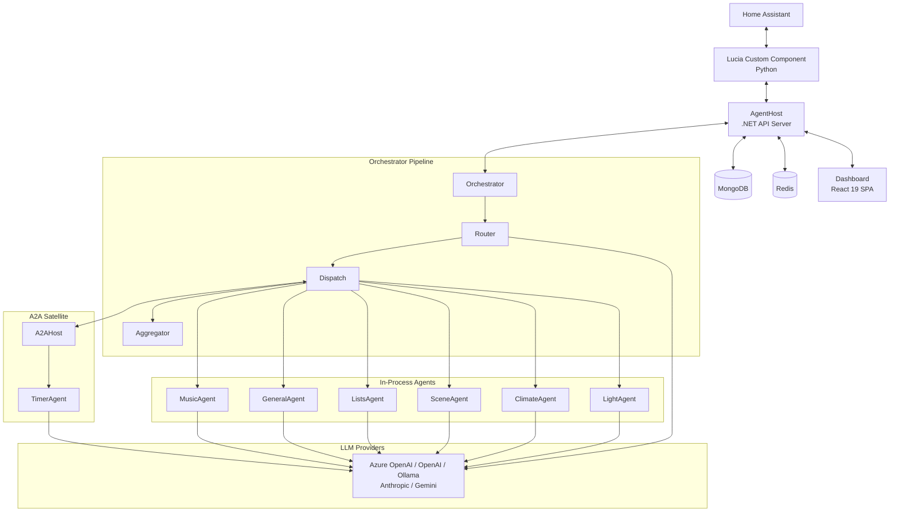

# Architecture Overview

Lucia is a privacy-first AI home assistant built on a multi-agent architecture. Agents communicate using the **A2A (Agent-to-Agent) Protocol** over **JSON-RPC 2.0**, enabling both in-process and distributed deployments without changing application code.

## System Diagram

## Key Components

| Component | Description |
|---|---|
| **AgentHost** | Main .NET API server. Hosts the orchestrator, in-process agents, REST and JSON-RPC endpoints, and the plugin system. |
| **A2AHost** | Satellite host for agents that run as separate processes or containers. Exposes the same A2A discovery and messaging interface. |
| **Orchestrator** | Three-stage pipeline: Router, Dispatch, Aggregator. Determines which agent handles a request, dispatches it, and formats the result. |
| **Dashboard** | React 19 single-page application for configuration, conversation history, entity management, and real-time monitoring. |
| **HA Integration** | Python custom component for Home Assistant. Bridges the HA Conversation API to Lucia over JSON-RPC. |
| **HomeAssistant Client** | .NET client library that communicates with the Home Assistant WebSocket API for entity state, service calls, and event subscriptions. |
| **EntityLocationService** | Maintains a location graph of areas, floors, and devices. Resolves natural-language room references to HA entity IDs. |
| **HybridEntityMatcher** | Multi-strategy entity matching combining Levenshtein distance, Jaro-Winkler similarity, phonetic encoding, embedding similarity, and alias resolution. |
| **Model Provider System** | Abstraction layer over LLM providers (Azure OpenAI, OpenAI, Ollama, Anthropic, Gemini). Supports per-agent model assignment and prompt caching. |
| **Plugin System** | Extensibility point for adding custom agents, tools, and middleware without modifying the core codebase. |

## Design Principles

- **Privacy-first.** All processing happens locally by default. No data leaves the network unless the user explicitly configures a cloud LLM provider.
- **Agent isolation.** Each agent owns a single domain. Agents do not share state or call each other directly; all coordination flows through the orchestrator.
- **Transport transparency.** Agents are unaware of whether they run in-process or over the network. The A2A protocol abstracts the transport layer.
- **Graceful degradation.** If a satellite A2AHost is unreachable, the orchestrator falls back to the GeneralAgent rather than failing the request.
