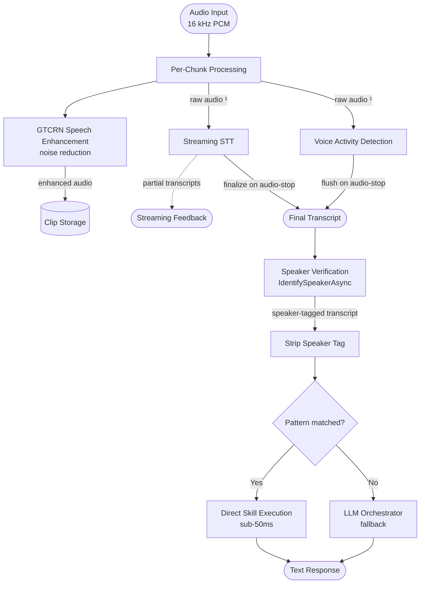
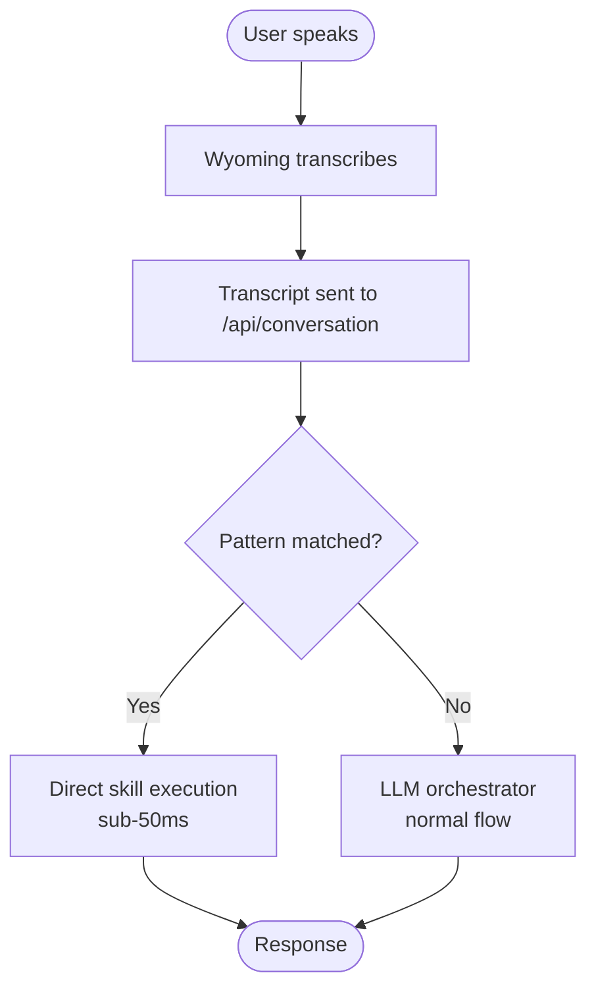
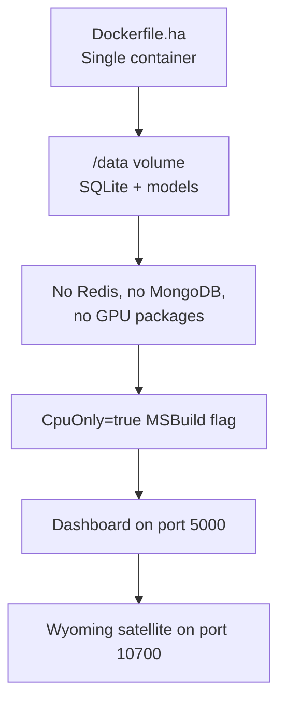
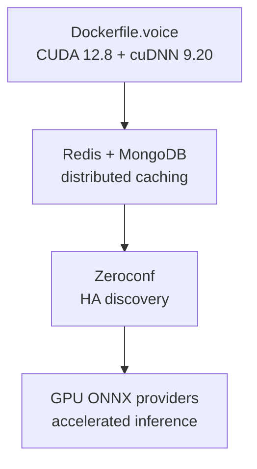

# Wyoming Voice Platform

The Wyoming Voice Platform transforms Lucia into a **Home Assistant-compatible voice satellite**, enabling local speech processing with zero cloud dependency. It implements the full [Wyoming protocol](https://github.com/rhasspy/wyoming), shipping a streaming speech pipeline, speaker verification, wake word detection, speech enhancement, and intelligent model management, all discoverable via Zeroconf/mDNS.

:::note v1.3.1 defaults
The generic AgentHost now leaves the VAD and wake-word pipelines disabled unless `FeatureManagement__VadPipeline=true` or `FeatureManagement__WakeWordPipeline=true`. Disabled pipelines don't register engines or activate models, reducing startup work for deployments that receive already-bounded utterances.
:::

## Architecture Overview



> **¹** STT and VAD receive **raw** (unenhanced) audio; this is intentional, avoiding spectral mismatch with speaker enrollment profiles. GTCRN-enhanced audio is only used for clip storage.

Each audio chunk is processed in parallel by three components. **GTCRN speech enhancement** reduces noise (for clip storage only), **Streaming STT** produces partial transcripts from the raw audio, and **VAD** detects speech/silence boundaries. STT and VAD intentionally receive raw (unenhanced) audio to avoid spectral mismatch with speaker enrollment profiles. On audio-stop, VAD flushes and STT finalizes to produce a high-accuracy transcript. **Speaker Verification** then identifies the speaker via cosine similarity against enrolled profiles, tagging the transcript. Finally, the **Conversation Command Parser** strips the speaker tag and attempts a fast pattern match (sub-50ms); unrecognized commands fall back to the LLM orchestrator. The platform runs as a persistent TCP service advertising itself to Home Assistant via Zeroconf, making it trivial to add as a Wyoming satellite without manual DNS or IP configuration.

## Multi-Engine Speech-to-Text

Lucia supports four STT engines, each optimized for different latency/accuracy tradeoffs:

### HybridSttEngine
**Best for:** Production, general use (recommended)

- Streams audio through a lightweight online model for sub-50ms preliminary feedback
- Simultaneously buffers the full utterance
- Once silence is detected, re-transcribes the complete utterance with a high-accuracy offline model
- Progressive re-transcription includes **burst detection** (detecting when speaker resumes mid-pause) and **stability-based early stopping** to avoid unnecessary re-runs

**Example:** User says "turn on the lights" → at 400ms you get "turn on the" (streaming), at 900ms you get "turn on the lights" (final), at 1100ms you get the same with confidence boost (stable).

### SherpaSttEngine
**Best for:** Ultra-low-latency demands, minimal CPU

- Pure streaming CTC/transducer inference with no offline re-transcription
- Produces results character-by-character as audio arrives
- Simpler pipeline, minimal memory footprint
- Accuracy lower than Hybrid; use it when latency matters more than accuracy

### SherpaOfflineSttEngine
**Best for:** Batch processing, highest accuracy

- Offline NeMo Parakeet TDT+CTC pipeline
- Requires complete utterance before processing starts
- Slowest of the four but highest word-error rate (WER)
- Used internally by HybridSttEngine for re-transcription

### GraniteOnnxEngine
**Best for:** Lightweight deployments (IBM Granite 4.0 1B)

- Compact speech-to-text ONNX model from IBM
- 3-stage pipeline: audio encoder → embed token generator → auto-regressive decoder with 40-layer KV cache
- Good balance of speed and accuracy on resource-constrained hardware

## ONNX Provider Auto-Detection

The `OnnxProviderDetector` runs at startup and probes for available GPU/accelerator support:


Each engine (Sherpa Diarization, HybridSTT, GraniteOnnx, GTCRN Speech Enhancer) independently detects and uses the best available provider. If a provider fails to initialize, the system falls back to CPU automatically, with no manual configuration needed.

**Verification flow:** The detector attempts `SessionOptions.AppendExecutionProvider_*()` before committing, preventing silent crashes when GPU libraries (CUDA, cuDNN) are missing.

**Dashboard visibility:** The Voice Platform → Status tab displays the active provider (e.g., "CUDA 12.8") with a GPU badge.

## Speaker Verification & Voice Profiles

Lucia maintains two speaker profile types:

### Enrolled Profiles
- User-created profiles with **cosine-similarity** verification
- Extracted from Sherpa-onnx speaker embeddings
- Configurable verification threshold (default: 0.75)
- Redis-cached for sub-millisecond lookup latency
- MongoDB-backed persistent storage

### Provisional Profiles
- Auto-discovered profiles for unknown speakers (first-time visitors)
- Tracked with interaction counters
- Automatically promoted to enrolled when confidence is consistently high
- Optional adaptive profile updates using exponential moving average

**Guided onboarding flow** in the dashboard validates audio quality (SNR, duration checks) before enrollment. Users can manage profiles, merge duplicates, reassign audio clips, and promote provisional → enrolled from the dashboard.

## Wake Word Detection

Registered wake phrases trigger conversation initiation without requiring manual activation:

- Custom phrase support (not limited to "Hey Alexa" style keywords)
- Per-speaker calibration to reduce false positives
- Integrated with VAD (voice activity detection) for accurate phrase boundaries
- Managed per-device from the Voice Platform → Wake Words tab

Example: Register "Lucia, listen up" as a custom phrase and the system wakes for exactly that trigger.

## GTCRN Speech Enhancement

**Gated Temporal Convolutional Recurrent Network** provides real-time streaming noise reduction:

- Operates on audio stream with overlap-add state per session
- Isolated per conversation (no cross-session noise bleed)
- Raw audio preserved separately for speaker verification (to avoid spectral mismatch with enrollment data)
- Optional; it can be disabled for cleaner, minimal-latency pipelines
- Reuses FFT, tensor, cache, and ONNX buffers; v1.3.0 reduced warm 256-sample hop allocations from about 144 KB to 1.4 KB

## Model Management Lifecycle

All voice models (STT, VAD, Wake Word, Speaker Embedding, Speech Enhancement) follow a unified lifecycle:


**Download:** Background SSE stream with real-time progress bars (download → extract → validate stages)

**Activation:** Hot-reload via `ActiveModelChanged` events; no restart required to switch models

**Per-engine model views:** Dedicated tabs for STT, Offline STT, VAD, Wake Word, Speaker Embedding, and Speech Enhancement models

**Startup validation:** Each active model runs a dummy inference warmup to catch incompatibilities before serving traffic

## Wyoming Protocol Integration

Lucia implements the full Wyoming satellite protocol for Home Assistant:

- **Persistent TCP connections** with per-session state management
- **Protocol events:** `audio-start`, `audio-chunk`, `audio-stop`, `transcribe`, `transcript`, `detect`, `not-detected`
- **Zeroconf/mDNS advertisement** for zero-config Home Assistant discovery
- **Home Assistant integration:** Settings → Devices & Services → Add Integration → Wyoming, then select Lucia

## Configuration

Voice platform configuration is stored by the selected SQLite, PostgreSQL, or MongoDB provider and hot-reloaded:

```json
{
  "FeatureManagement": {
    "VadPipeline": false,
    "WakeWordPipeline": false
  },
  "Wyoming": {
    "TcpPort": 10700,
    "VadThreshold": 0.7,
    "SpeechStartMs": 200,
    "SpeechEndMs": 500,
    "HuggingFaceApiToken": "hf_...",
    "DefaultSttEngine": "HybridSttEngine",
    "SpeakerVerificationThreshold": 0.75,
    "EnableAdaptiveProfiles": true,
    "ProvisionalRetentionDays": 30,
    "EnableSpeechEnhancement": true
  }
}
```

Environment-variable equivalents:

```bash
FeatureManagement__VadPipeline=true
FeatureManagement__WakeWordPipeline=true
```

All settings can be edited from the Voice Platform → Config panel in the dashboard with live persistence.

## Dashboard: Voice Platform Page

The dashboard provides a unified control room for voice operations:

### Status Tab
- Engine readiness tiles (STT, VAD, Wake Word, Speaker Embedding, Speech Enhancement)
- Active model indicators per engine
- ONNX provider detection display with GPU badge
- Guided next-steps checklist for first-time setup

### Models Tab
- Browse available models per engine
- Download with real-time progress
- Activate/deactivate models (hot-reload)
- Delete models from disk
- Model compatibility filtering by architecture

### Profiles Tab
- View enrolled speaker profiles with match confidence
- Inline rename and merge
- Promote provisional → enrolled
- Audio clip management: playback, download, reassign, delete
- Voice enrollment onboarding wizard

### Wake Words Tab
- Register custom wake phrases
- Optional per-speaker enrollment for phrase
- Manage and delete entries
- Test wake detection against uploaded audio

### Monitor Tab
- Real-time session monitoring via SSE
- Audio level meters
- Transcript log with timing
- Connection status and throughput metrics

### Config Panel
- Verification threshold slider
- Provisional profile settings
- Adaptive profile toggle
- Retention day controls
- TCP port and VAD sensitivity tuning

## Integration with Conversation Command Parser

The Wyoming platform pairs with the **Conversation Command Parser** (see [Conversation API docs](../api/conversation-api.md)):



This two-tier architecture delivers the speed of pattern matching for common commands ("turn on the lights") with the flexibility of LLM reasoning for complex requests.

## Deployment Scenarios

### Development + Testing
```json
{
  "DataProvider": { "Cache": "InMemory", "Store": "SQLite" },
  "Wyoming": { "TcpPort": 10700 }
}
```
No external dependencies. Local STT models download on first startup.

### Home Assistant Add-on (CPU-Only)


### Production (GPU Accelerated)


## Performance Characteristics

| Metric | Value |
|--------|-------|
| Streaming STT latency | ~50ms |
| Final transcript latency (Hybrid) | ~90ms |
| Speaker identification (cached) | ~1ms |
| Speaker identification (cold) | ~500ms |
| Wake word detection latency | `<100ms` |
| ONNX model warmup (first inference) | ~500ms–2s |
| Model hot-reload downtime | `<100ms` |

### Concurrency and Shutdown

STT concurrency is enforced around inference, not around the full Wyoming connection. Idle wake-word listeners can remain connected without consuming STT permits. During shutdown, Lucia drains active sessions under a bounded deadline before aborting remaining transports.

### Speaker Verification Benchmarks

Version 1.3.1 adds a reproducible benchmark for comparing speaker-embedding models against labeled enrollment and test clips:

```bash
dotnet run --project lucia.VoiceBenchmarks -- speaker \
  --manifest benchmarks/voice/sample-manifest.json \
  --model path/to/model.onnx \
  --model-threshold 0.7 \
  --output benchmarks/results
```

Each speaker needs separate enrollment and test sessions. Reports include identification accuracy, model timings, process memory, and managed allocations in stable JSON and Markdown formats.

## Next Steps

- [Voice Platform Dashboard](../dashboard/overview.md): detailed dashboard features and configuration options
- [Conversation API](../api/conversation-api.md): pattern matching and command execution
- [Deployment Guide](../deployment/overview.md): voice platform deployment scenarios
- Home Assistant Settings → Devices & Services → Add Integration → Wyoming to activate
