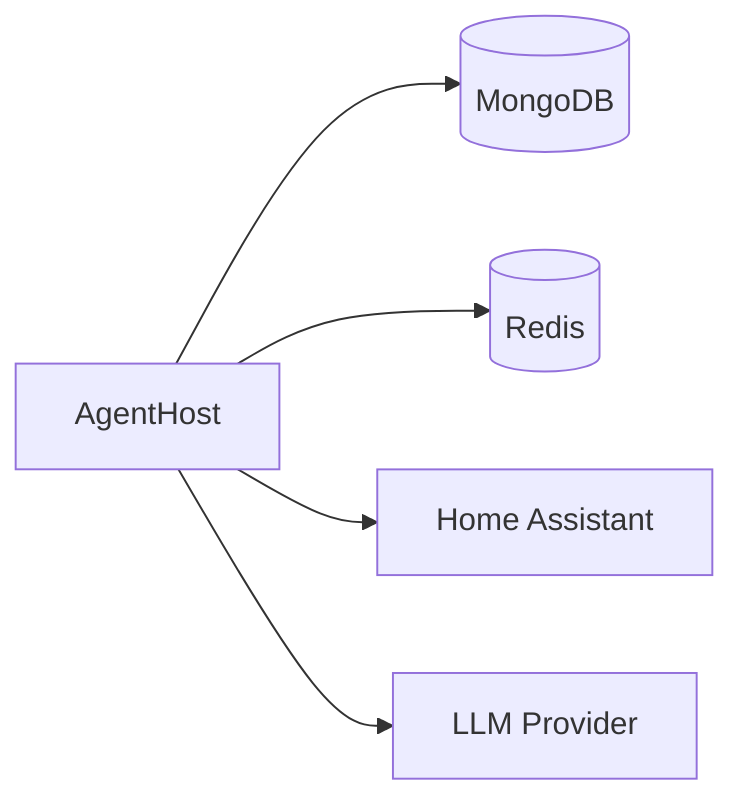
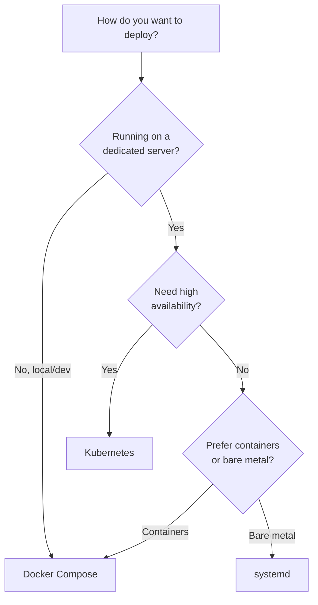

# Deployment Overview

Lucia can be deployed using several methods depending on your infrastructure, scale, and operational preferences. All methods deploy the same AgentHost application with the same capabilities.

## Deployment Methods

| Method | Best For | Setup Time | Complexity |
|---|---|---|---|
| [Docker Compose](./docker-compose.md) | Home servers, fast setup, single-node | < 2 minutes | Low |
| [Kubernetes](./kubernetes.md) | High availability, scalability, production | 5-10 minutes | Medium |
| [Helm Chart](./helm.md) | Kubernetes with templated config | 5-10 minutes | Medium |
| [systemd](./systemd.md) | Traditional Linux, bare metal, no containers | 5-15 minutes | Medium |

## Deployment Modes

Lucia supports two deployment topologies via `Deployment__Mode`:

- **Standalone** (default) -- All agents run in the main AgentHost process. Single container + Redis + MongoDB.
- **Mesh** -- Agents run as separate A2A containers. Used for Kubernetes and multi-node deployments.

## CI/CD

Lucia includes GitHub Actions workflows for automated builds, testing, and deployment. See the `.github/workflows` directory in the repository for the pipeline definitions.

## Architecture

Regardless of deployment method, Lucia requires three backing services:

| Service | Purpose | Required |
|---|---|---|
| **MongoDB** | Configuration, traces, and task storage | Yes |
| **Redis** | Conversation context cache and prompt cache | Yes |
| **Home Assistant** | Smart home platform | Yes |
| **LLM Provider** | Language model for agent reasoning | Yes |

## Choosing a Deployment Method

:::tip
If you are unsure which method to choose, **start with Docker Compose**. It is the fastest path to a working deployment. You can migrate to Kubernetes later if needed -- all configuration is portable across methods.
:::

## Minimum Requirements

| Resource | Minimum | Recommended |
|---|---|---|
| CPU | 2 cores | 4 cores |
| RAM | 2 GB | 4 GB |
| Disk | 5 GB | 20 GB |
| Network | LAN access to Home Assistant | -- |

:::info
These requirements cover the AgentHost, MongoDB, and Redis. If you are running a local LLM via Ollama, you will need additional resources based on the model size.
:::

## Next Steps

- [Docker Compose](./docker-compose.md) -- Recommended for most users
- [Kubernetes](./kubernetes.md) -- For production and high-availability deployments
- [Helm Chart](./helm.md) -- Kubernetes deployment with Helm
- [systemd](./systemd.md) -- Bare metal deployment
- [Deployment Comparison](./comparison.md) -- Detailed comparison of all methods
