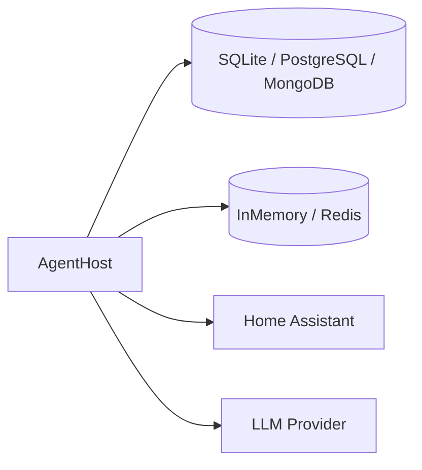
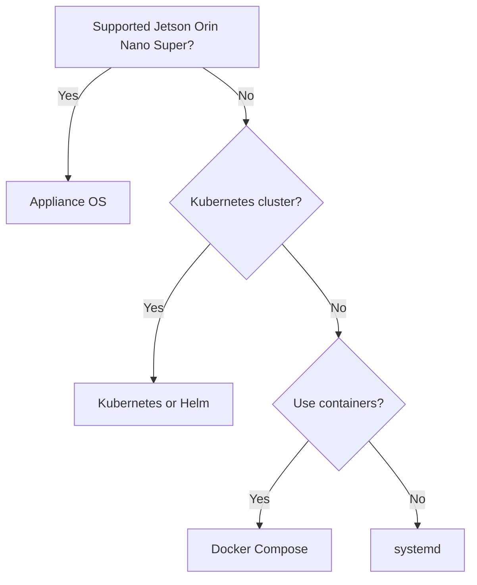

# Deployment Overview

Lucia Appliance OS is the preferred path for a new dedicated system. Docker Compose, Kubernetes, Helm, and systemd remain maintained alternatives with the same AgentHost features.

## Deployment Methods

| Method | Best For | Setup Time | Complexity |
|---|---|---|---|
| [Appliance OS](../getting-started/appliance-os.md) | New dedicated Lucia system on supported Jetson hardware | Guided captive portal | Low |
| [Docker Compose](./docker-compose.md) | Home servers, fast setup, single-node | < 2 minutes | Low |
| [Kubernetes](./kubernetes.md) | High availability, scalability, production | 5-10 minutes | Medium |
| [Helm Chart](./helm.md) | Kubernetes with templated config | 5-10 minutes | Medium |
| [systemd](./systemd.md) | Traditional Linux, bare metal, no containers | 5-15 minutes | Medium |
| [Jetson CUDA Compose](./docker-compose.md#jetson-arm64-cuda-compose-deployment) | Operator-managed containers on Jetson | 10-20 minutes | Medium |

## Deployment Modes

Lucia supports two deployment topologies via `Deployment__Mode`:

- **Standalone** (default): All agents run in the main AgentHost process. Storage and cache providers are selectable.
- **Mesh**: Agents run as separate A2A containers. Used for Kubernetes and multi-node deployments.

## CI/CD

Lucia includes GitHub Actions workflows for automated builds, testing, and deployment. See the `.github/workflows` directory in the repository for the pipeline definitions.

## Architecture

Every deployment requires Home Assistant and an LLM provider. Persistence and caching can be embedded or external:

```mermaid
graph LR
    AH[AgentHost] --> Store[(SQLite / PostgreSQL / MongoDB)]
    AH --> Cache[(InMemory / Redis)]
    AH --> HA[Home Assistant]
    AH --> LLM[LLM Provider]
```

| Service | Purpose | Required |
|---|---|---|
| **SQLite, PostgreSQL, or MongoDB** | Configuration, traces, memory, and task storage | Yes, choose one |
| **InMemory or Redis** | Conversation context and prompt cache | Yes, choose one |
| **Home Assistant** | Smart home platform | Yes |
| **LLM Provider** | Language model for agent reasoning | Yes |

## Choosing a Deployment Method

```mermaid
graph TD
    Start[Supported Jetson Orin Nano Super?] -->|Yes| Appliance[Appliance OS]
    Start -->|No| Q1{Kubernetes cluster?}
    Q1 -->|Yes| K8s[Kubernetes or Helm]
    Q1 -->|No| Q2{Use containers?}
    Q2 -->|Yes| Docker[Docker Compose]
    Q2 -->|No| Systemd[systemd]
```

:::tip
Choose **Appliance OS** for a new supported Jetson. If you're using other hardware, start with Docker Compose; move to Kubernetes or systemd when your host requirements call for them.
:::

## Minimum Requirements

| Resource | Minimum | Recommended |
|---|---|---|
| CPU | 2 cores | 4 cores |
| RAM | 2 GB | 4 GB |
| Disk | 5 GB | 20 GB |
| Network | LAN access to Home Assistant | -- |

:::info
These requirements cover AgentHost and lightweight providers. External databases, the observability stack, local LLMs, and voice models need additional resources.
:::

## Next Steps

- [Appliance OS](../getting-started/appliance-os.md): Preferred guided installation on supported Jetson hardware
- [Docker Compose](./docker-compose.md): Existing servers and non-appliance hardware
- [Kubernetes](./kubernetes.md): For production and high-availability deployments
- [Helm Chart](./helm.md): Kubernetes deployment with Helm
- [systemd](./systemd.md): Bare metal deployment
- [Observability](./observability.md): Remote telemetry and Grafana dashboards
- [Deployment Comparison](./comparison.md): Detailed comparison of all methods
