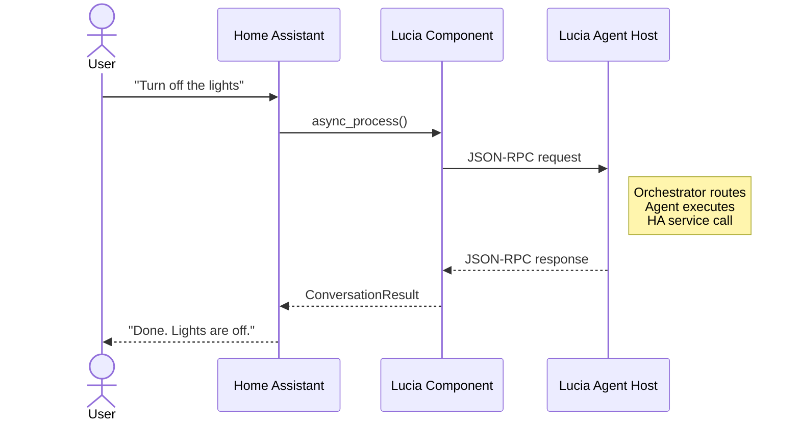

# Conversation API

The Lucia Home Assistant integration implements the [Conversation API](https://developers.home-assistant.io/docs/intent_conversation_api/), which is how Home Assistant routes voice and text commands to conversation agents. This page explains the full request and response flow between Home Assistant and the Lucia agent host.

## Overview

When a user speaks or types a command in Home Assistant, the Assist pipeline forwards it to the configured conversation agent. If Lucia is set as the conversation agent, the custom component receives the text and sends it to the Lucia agent host for processing.

## Request Flow

### 1. Input Arrives in Home Assistant

A command enters through one of several paths:

- **Voice satellite** (e.g., Wyoming, ESPHome) -- speech is transcribed to text by the STT engine.
- **Assist dialog** -- the user types a command in the HA frontend.
- **Automation** -- a `conversation.process` service call triggers a command programmatically.

### 2. HA Calls the Conversation API

Home Assistant invokes the Lucia integration's `async_process` method with:

- **text** -- the user's command as a string.
- **conversation_id** -- a unique identifier for multi-turn conversation tracking (optional).
- **language** -- the user's language code.

### 3. JSON-RPC Call to Lucia

The custom component translates the Conversation API call into a **JSON-RPC request** and sends it to the Lucia agent host:

```json
{
  "jsonrpc": "2.0",
  "method": "conversation.process",
  "params": {
    "text": "Turn off the kitchen lights",
    "conversationId": "ha-conv-abc123",
    "language": "en",
    "exposedEntities": ["light.kitchen_ceiling", "light.kitchen_counter"],
    "context": {
      "userId": "ha-user-1",
      "areaId": "kitchen"
    }
  },
  "id": 1
}
```

The request includes:

- The user's command text.
- The conversation ID for context continuity.
- The list of currently exposed entities (from the [entity management](./entity-management.md) system).
- Optional context about the user and their location.

### 4. AgentHost Orchestration

The Lucia **AgentHost orchestrator** receives the JSON-RPC request and:

1. Parses the user's intent from the text.
2. Selects the appropriate specialized agent (e.g., Light Agent for lighting commands).
3. The agent executes the command, which may involve calling Home Assistant services (via the HA REST API or WebSocket).
4. The agent produces a natural language response.

## Response Flow

### 5. JSON-RPC Response

The agent host returns a JSON-RPC response to the custom component:

```json
{
  "jsonrpc": "2.0",
  "result": {
    "response": {
      "speech": {
        "plain": {
          "speech": "I've turned off the kitchen lights.",
          "extra_data": null
        }
      },
      "card": {},
      "language": "en",
      "response_type": "action_done",
      "data": {
        "targets": [],
        "success": [
          {
            "id": "light.kitchen_ceiling",
            "name": "Kitchen Ceiling",
            "type": "entity"
          },
          {
            "id": "light.kitchen_counter",
            "name": "Kitchen Counter",
            "type": "entity"
          }
        ],
        "failed": []
      }
    },
    "conversationId": "ha-conv-abc123"
  },
  "id": 1
}
```

### 6. Response Delivered to Home Assistant

The custom component translates the JSON-RPC response back into a HA `ConversationResult`:

- The **speech text** is passed to the TTS engine for voice output (if using a voice satellite).
- The **response data** is displayed in the Assist dialog or returned to the calling automation.
- The **conversation ID** is preserved for multi-turn follow-ups.

## Multi-Turn Conversations

Conversation state is maintained by the `conversationId`. When a user asks a follow-up question, the same ID is sent, allowing the agent to reference previous context:

**Turn 1:**
> "What's the temperature in the living room?"
> "The living room thermostat reads 72 degrees."

**Turn 2:**
> "Set it to 68."
> "I've set the living room thermostat to 68 degrees."

The agent understands "it" refers to the living room thermostat because the conversation ID links both turns.

## Error Handling

If the agent host is unreachable or returns an error, the custom component returns a graceful error response to Home Assistant:

```json
{
  "response": {
    "speech": {
      "plain": {
        "speech": "I'm sorry, I wasn't able to process that request. The Lucia agent host may be unavailable."
      }
    },
    "response_type": "error",
    "data": {
      "code": "agent_unavailable"
    }
  }
}
```

:::info
Home Assistant will still display or speak the error message, so the user receives feedback even when something goes wrong.
:::

## Sequence Diagram


