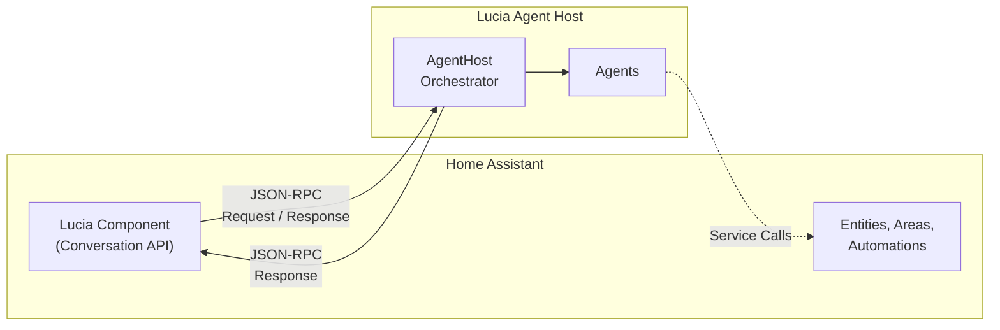

# Home Assistant Integration

Lucia integrates with [Home Assistant](https://www.home-assistant.io/) through a custom component that connects your smart home to the Lucia agent system. The integration implements Home Assistant's **Conversation API**, allowing you to use Lucia as your voice and text assistant directly within the HA ecosystem.

## Architecture

The integration is a **Python custom component** that runs inside Home Assistant. It communicates with the Lucia .NET agent host over **JSON-RPC**, bridging the gap between HA's Python runtime and Lucia's multi-agent orchestration system.

## How It Works

1. **Voice or text input** arrives in Home Assistant (via the Assist pipeline, a dashboard card, or a voice satellite).
2. The **Lucia custom component** receives the input through the Conversation API.
3. The component sends the text to the **Lucia agent host** via a JSON-RPC call.
4. The **AgentHost orchestrator** routes the request to the appropriate specialized agent (lighting, climate, media, etc.).
5. The agent processes the command, calls Home Assistant services as needed, and returns a response.
6. The response flows back through JSON-RPC to the custom component, which delivers it to Home Assistant for **speech output or display**.

## Key Capabilities

- **Natural language control** -- "Turn off the living room lights" or "Set the thermostat to 72" without rigid command syntax.
- **Entity awareness** -- Lucia sees your exposed entities, areas, and floors, and uses them to understand context.
- **Conversation history** -- Multi-turn conversations are maintained so you can issue follow-up commands naturally.
- **Agent selection** -- Choose which Lucia agent handles your Home Assistant conversations.

## What's Next?

- [Installation](./installation.md) -- install the custom component via HACS or manually.
- [Configuration](./configuration.md) -- connect the component to your Lucia instance.
- [Entity Management](./entity-management.md) -- control which entities Lucia can see and interact with.
- [Conversation API](./conversation-api.md) -- understand the request/response flow in detail.
